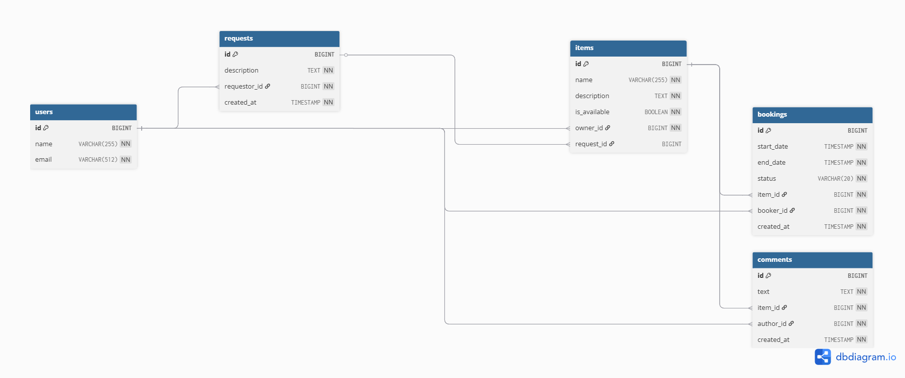

# ShareIt - Система для совместного использования вещей

## 📌 Обзор проекта

**ShareIt** — это полнофункциональная система для шеринга вещей, построенная по микросервисной архитектуре. Она позволяет пользователям:

- 🛠️ **Добавлять вещи для аренды**
- 📅 **Бронировать вещи других пользователей**
- 💬 **Оставлять отзывы о вещах**
- 🔍 **Искать доступные вещи**
- 📝 **Создавать запросы на вещи**

Система состоит из двух основных компонентов:

1. **ShareIt Server** — основное серверное приложение (REST API, бизнес-логика, БД)
2. **ShareIt Gateway** — шлюз для валидации, маршрутизации и единой точки входа

---

## 🏗️ Архитектура и компоненты

### 1. ShareIt Server (Серверная часть)
Полнофункциональное RESTful веб-приложение на Java с Spring Boot.  
Более подробно [README.md](server/README.md)

**Основные возможности:**
- Управление пользователями, вещами, бронированиями и запросами
- Полноценная бизнес-логика с валидациями
- Работа с базой данных (PostgreSQL/H2)
- Обработка исключений и логирование

**Технологический стек:**
- **Язык**: Java 17+
- **Фреймворки**: Spring Boot 3+, Spring Data JPA, Hibernate
- **Базы данных**: PostgreSQL / H2
- **Инструменты**: Lombok, MapStruct, Maven
- **Тестирование**: JUnit 5
- **Валидация**: Jakarta Validation
- **Логирование**: SLF4J + Logback

### 2. ShareIt Gateway (Микросервис-шлюз)
Промежуточный слой между клиентами и основным сервером.  
Более подробно [README.md](gateway/README.md)

**Основные функции:**
- Валидация входящих запросов
- Маршрутизация к основному серверу
- Единая точка входа для всех API
- Проксирование заголовка `X-Sharer-User-Id`

**Технологический стек:**
- Spring Boot 3.x (Web, Validation)
- Spring WebClient / RestTemplate
- Jakarta Validation API
- Lombok, Maven

---

## 🚀 Быстрый старт

### Предварительные требования:
- Java 17 или выше
- Maven 3.8+
- PostgreSQL 14+ (для продакшена) или H2 (для разработки)

### Порядок запуска:

#### Запуск ShareIt Server:
```bash
  cd shareit-server
  mvn clean package
  java -jar target/shareit-server.jar
```
#### Запуск ShareIt Gateway:

```bash
  cd shareit-gateway
  mvn clean package
  java -jar target/shareit-gateway.jar
```
# 📚 API Документация

## 🚀 Запуск сервисов

**По умолчанию:**

| Компонент | URL                          |
|-----------|------------------------------|
| Сервер    | http://localhost:9090        |
| Шлюз      | http://localhost:8080        |

> **Важно:** Все клиентские запросы должны идти через шлюз.

## 🔗 Базовые URL

| Способ доступа     | URL                   | Рекомендация          |
|--------------------|-----------------------|-----------------------|
| Через шлюз         | http://localhost:8080 | ✅ Рекомендуется       |
| Напрямую к серверу | http://localhost:9090 | ⚠️ Только для отладки |

## 📊 Основные эндпоинты

| Компонент        | Методы                   | Эндпоинты   | Описание                     |
|------------------|--------------------------|-------------|------------------------------|
| **Пользователи** | GET, POST, PATCH, DELETE | `/users`    | Управление пользователями    |
| **Вещи**         | GET, POST, PATCH         | `/items`    | Управление вещами            |
| **Бронирования** | GET, POST, PATCH         | `/bookings` | Управление бронированиями    |
| **Запросы**      | GET, POST                | `/requests` | Управление запросами на вещи |

## 🔐 Авторизация

Все запросы, требующие идентификации пользователя, должны включать заголовок:  
X-Sharer-User-Id: <user_id>  
**Пример:**
```http
X-Sharer-User-Id: <user_id>
Пример запроса через шлюз:
bash
curl -X POST http://localhost:8080/items \
-H "Content-Type: application/json" \
-H "X-Sharer-User-Id: 1" \
-d '{
"name": "Дрель",
"description": "Аккумуляторная дрель",
"available": true
}'
```
### 🗄️ Модели данных
Схема базы данных доступна в файле:[schema.sql](server/src/main/resources/schema.sql)


# 🔧 Особенности реализации

## 1. Пагинация
Все методы, возвращающие списки, поддерживают пагинацию через параметры:
- **`from`** — начальный индекс (по умолчанию 0)
- **`size`** — количество элементов на странице (по умолчанию 10)

## 2. Валидация
Валидация входных данных на всех уровнях:
- Проверка уникальности email пользователей
- Валидация дат бронирования
- Проверка доступности вещей
- Кастомные аннотации валидации

## 3. Безопасность
Проверка прав доступа к операциям:
- Валидация владельцев вещей
- Защита от пересечения бронирований
- Валидация статусов бронирований

## 4. Обработка исключений
Централизованная обработка исключений с соответствующими HTTP-статусами:
- **404 Not Found** — ресурс не найден
- **400 Bad Request** — ошибка валидации
- **403 Forbidden** — отказано в доступе
- **409 Conflict** — конфликт данных

## 🧪 Тестирование
### Запуск тестов:
```bash
  # Для сервера
  cd shareit-server
  mvn test

# Для шлюза
  cd shareit-gateway
  mvn test
```
## 🧪 Профили тестирования
- Используется H2 in-memory база данных
- Отдельная конфигурация логирования
- Тестовые логи сохраняются в `target/test-logs/`

## 📊 Логирование
Оба компонента используют SLF4J с Logback для логирования:

### Уровни логирования:
- **INFO** - основные операции приложения
- **DEBUG** - детальная информация для отладки
- **WARN** - предупреждения
- **ERROR** - ошибки

### Настройки вывода:
- Консольный вывод с цветной подсветкой
- Файловый вывод с детальной информацией
- Раздельные конфигурации для dev/test/prod

## 🐛 Устранение неполадок
### Распространенные проблемы:

#### 1. Ошибка подключения между шлюзом и сервером
- Проверьте, что оба сервиса запущены
- Убедитесь, что URL сервера в настройках шлюза корректен
- Проверьте настройки портов в `application.properties`

#### 2. Ошибки валидации
- Проверьте формат JSON запросов
- Убедитесь, что все обязательные поля заполнены
- Проверьте уникальность email при регистрации

#### 3. Ошибки доступа
- Проверьте наличие заголовка `X-Sharer-User-Id`
- Убедитесь, что пользователь существует
- Проверьте права доступа к операциям

#### 4. Ошибки базы данных
- Проверьте настройки подключения в `application.properties`
- Убедитесь, что база данных запущена
- Для H2: проверьте доступность консоли

### Конфигурационные файлы:
- `application.properties` / `application.yaml` - основные настройки
- `schema.sql` - схема базы данных
- `logback.xml` / `logback-test.xml` - настройки логирования